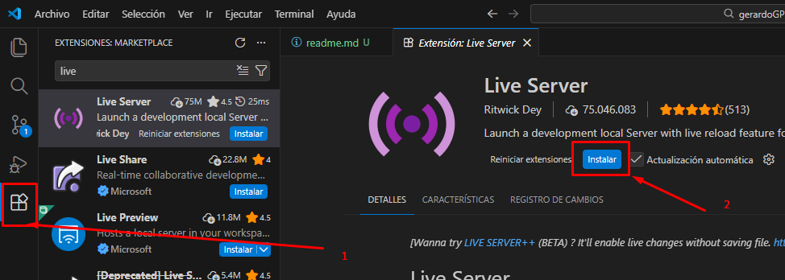
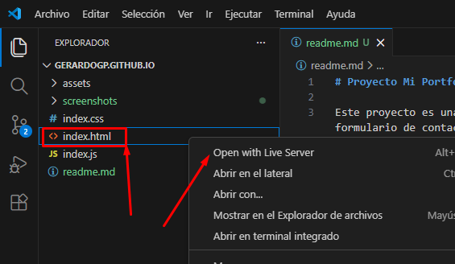

# Proyecto Mi Portfolio

Este proyecto es una pagina web que permite ver mi información personal: resmun, sobre mi, mi experiencia laboral, mis cursos / certificados, proyectos realizados y un formulario de contacto vinculado a [Formspree](https://formspree.io/).

## Instalación
1. Clonar el repositorio
<pre>
    git clone https://github.com/gerardoGP/gerardoGP.github.io.git
</pre>

2. Editar archivo `index.html` con el editor de codigo [Visual Studio Code](https://code.visualstudio.com/download)
3. Instalar la extensión **LIVE SERVER** para visualizar en tiempo real los cambios que haga al archivo `index.html`
    3.1 Instalar **LIVE SERVER**
    

    
📸 Haz clic aquí para ver la captura de pantalla

     
    
    

    
    3.2 Ubicar el archivo `index.html`, hacer **clic derecho**, en las opciones desplegadas hacer clic en **Open with Live Server**
    

    
📸 Haz clic aquí para ver la captura de pantalla

     
    
    

## Licencia
Este proyecto está bajo la licencia MIT.